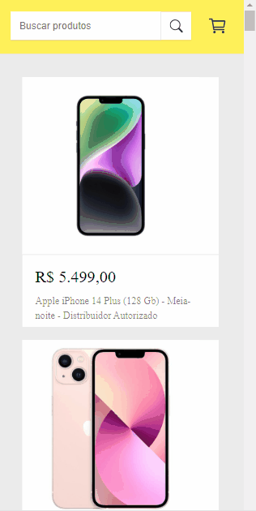

# Shopping Cart

 ## Veja como ficou o projeto:
 
 ## Desktop:

  
  ## Mobile:
   
  
   
  ## Do que se trata esse projeto?
Este projeto trata-se de um simulador de site de compras do mercado livre, usando a biblioteca REACT.
A busca pelos produtos é feita através de uma requisição feita a api do [MERCADO LIVRE](https://api.mercadolibre.com/sites/MLB/search?q=).

## Quais interações são realizadas?
- O usuário pode pesquisar através do input por produtos eletrônicos como IPHONE, MICROFONE, COMPUTADOR,etc.
- É possível adicionar os produtos ao carrinho, que faz a soma total dos produtos adicionados e, também é possível remover produtos
e a soma já é atualizada.

  
## Habilidades desenvolvidas:
- Uso de flexbox para ajustes dos elementos na tela.
- Uso e manipulação dos elementos no JavaScript.
- Uso da biblioteca REACT para melhor divisão do código, com o uso de componentes e props,deixando assim o código mais limpo e de fácil entendimento,
 facilitando futuras manutenções.
- Uso de hooks.
- Uso do método fetch para realizar a requisição à API.
- Uso de funções assíncronas, eventos, condicionais.

## Linguagens Utilizadas:
- HTML 

- CSS  

- JAVASCRIPT  

## Biblioteca utilizada:

-REACT      
          

Para ver o projeto pronto, [CLIQUE AQUI!](https://jessica-os.github.io/shopping-cart/)
